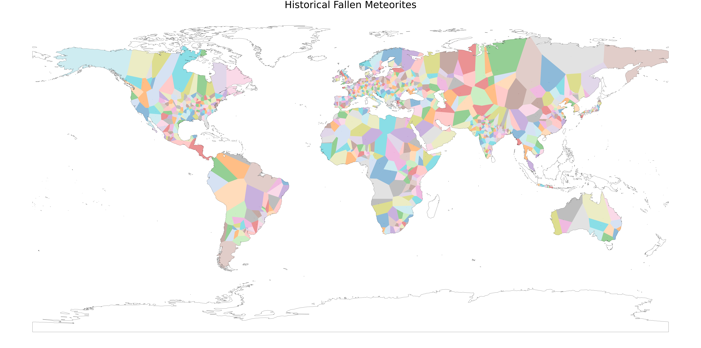

## Welcome to GitHub Pages

This is the website to publish the academic practise on Data Visualization. 

The meteorite dataset used was downloaded from Kaggle:
https://www.kaggle.com/datasets/nasa/meteorite-landings

### Result

